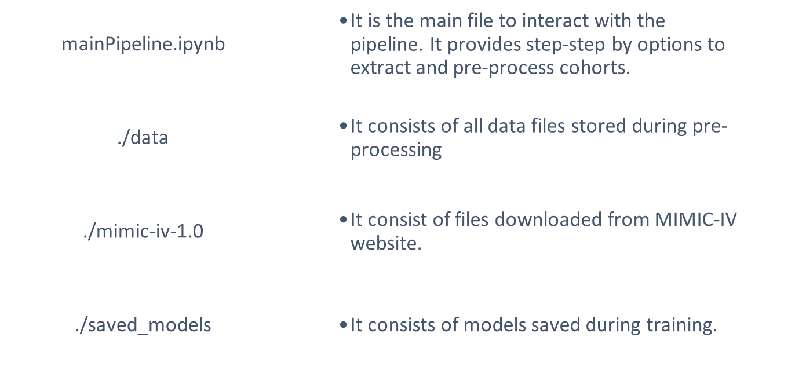
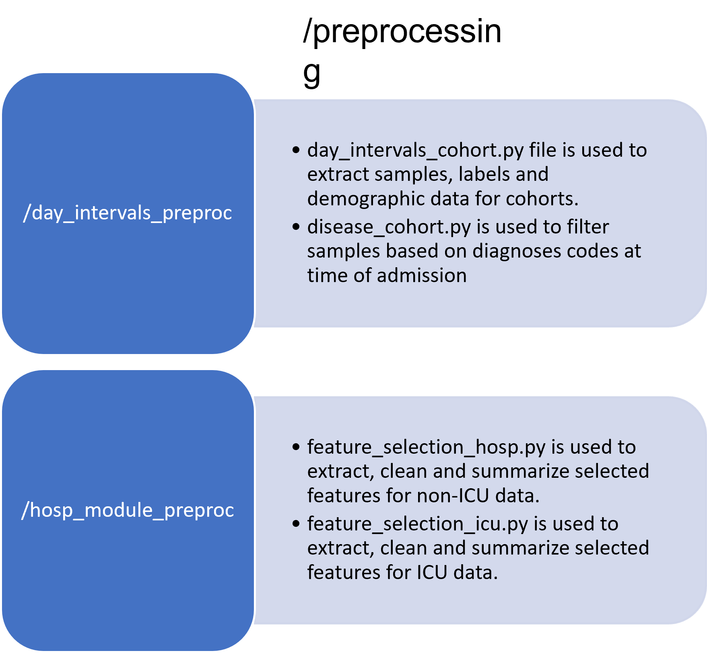
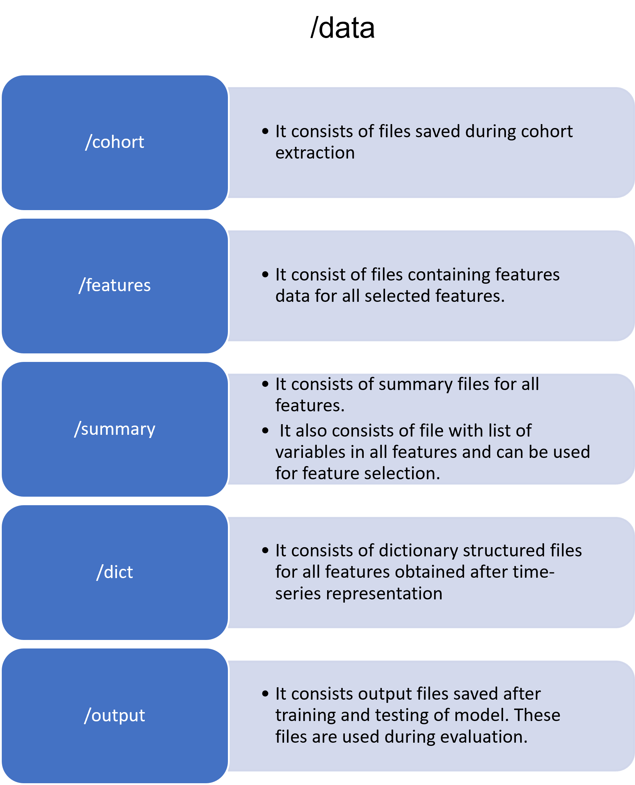
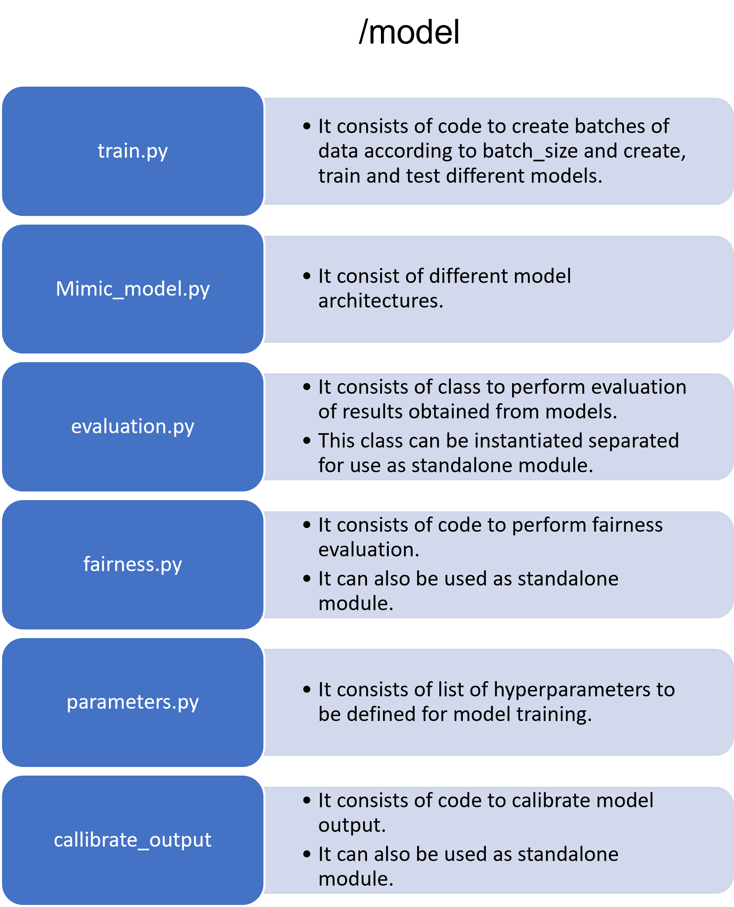

# MIMIC-IV
**MIMIC-IV data pipeline** is an end-to-end pipeline that offers a configurable framework to prepare MIMIC-IV data for the downstream tasks. 
The pipeline cleans the raw data by removing outliers and allowing users to impute missing entries. 
It also provides options for the clinical grouping of medical features using standard coding systems for dimensionality reduction.  
All of these options are customizable for the users, allowing them to generate a personalized  patient cohort. 
The customization steps can be recorded for the reproducibility of the overall framework. 
The pipeline produces a smooth time-series dataset by binning the sequential data into equal-length time intervals and allowing for filtering of the time-series length according to the user's preferences.
Besides the data processing modules, our pipeline also includes two additional modules for modeling and evaluation. 
For modeling, the pipeline includes several commonly used sequential models for performing prediction tasks. 
The evaluation module offers a series of standard methods for evaluating the performance of the created models. 
This module also includes options for reporting individual and group fairness measures.

##### Citing MIMIC-IV Data Pipeline:
MIMIC-IV Data Pipeline is available on arxive (https://arxiv.org/abs/2204.13841).
If you use MIMIC-IV Data Pipeline in a scientific publication, we would appreciate citations to the following paper.

@article{gupta2022extensive,
  title={An Extensive Data Processing Pipeline for MIMIC-IV},
  author={Gupta, Mehak and Gallamoza, Brennan and Cutrona, Nicolas and Dhakal, Pranjal and Poulain, Raphael and Beheshti, Rahmatollah},
  journal={arXiv preprint arXiv:2204.13841},
  year={2022}
}

##### Steps to download MIMIC-IV dataset for the pipeline

Go to https://physionet.org/content/mimiciv/1.0/

Follow instructions to get access to MIMIC-IV dataset.

Download the files using your terminal: wget -r -N -c -np --user mehakg --ask-password https://physionet.org/files/mimiciv/1.0/

Below we show he repo structure.

Output Dictionary Structure for all features after time-series representation.

