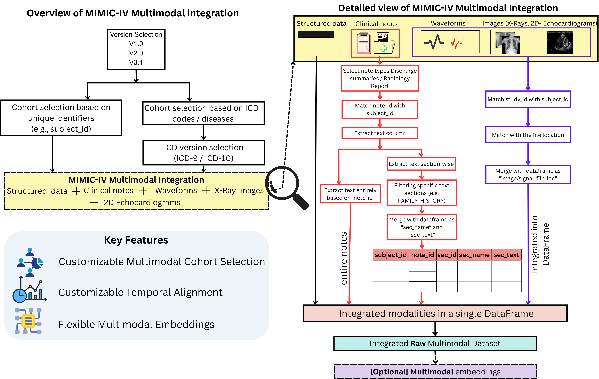

# MIMIC-IV Multimodal Pipeline


**MIMIC-IV data pipeline** is an end-to-end pipeline that offers a configurable framework to prepare MIMIC-IV data for the downstream tasks. 
The pipeline cleans the raw data by removing outliers and allowing users to impute missing entries. 
It also provides options for the clinical grouping of medical features using standard coding systems for dimensionality reduction.  
All of these options are customizable for the users, allowing them to generate a personalized  patient cohort. 
The customization steps can be recorded for the reproducibility of the overall framework. 
The pipeline produces a smooth time-series dataset by binning the sequential data into equal-length time intervals and allowing for filtering of the time-series length according to the user's preferences.
In addition to the data processing modules, our pipeline includes two further modules for modeling and evaluation. 
For modeling, the pipeline includes several commonly used sequential models for performing prediction tasks. 
The evaluation module provides a set of standard methods for assessing the performance of the created models. 
This module also includes options for reporting individual and group fairness measures.

**MIMIC-IV Multimodal Pipeline**
A MIMIC IV multimodal pipeline integrating multiple modalities, including structured data (e.g., vitals, labs, medications), unstructured data (e.g., clinical notes, radiology reports), waveforms (e.g., electrocardiogram signals), and imaging data (e.g., chest X-rays, echocardiograms). While each modality has been individually leveraged in prior research, these modalities remain disjointed in their storage and access, requiring extensive manual effort to preprocess and align them for downstream analysis. In this work, we introduce a comprehensive and customizable multimodal data processing pipeline for MIMIC-IV that systematically integrates five modalities.

##### Citing MIMIC-IV Data Pipeline:

If you use the MIMIC-IV Data Pipeline, we would appreciate citations to the following papers.

Our multimodal extensions are discussed on our [arXiv preprint](https://arxiv.org/abs/2601.11606):
```
@ARTICLE{Adiba2026-ac,
  title         = "A multimodal data processing pipeline for {MIMIC-IV} dataset",
  author        = "Adiba, Farzana Islam and Danduri, Varsha and Piya, Fahmida
                   Liza and Abbasi, Ali and Gupta, Mehak and Beheshti,
                   Rahmatollah",
  month         =  jan,
  year          =  2026,
  copyright     = "http://creativecommons.org/licenses/by/4.0/",
  archivePrefix = "arXiv",
  primaryClass  = "cs.LG",
  eprint        = "2601.11606"
}

```
Our original MIMIC-IV Data Pipeline is available on [ML4H proceedings](https://proceedings.mlr.press/v193/gupta22a/gupta22a.pdf).

```
@InProceedings{gupta2022extensive,
  title = 	 {{An Extensive Data Processing Pipeline for MIMIC-IV}},
  author =       {Gupta, Mehak and Gallamoza, Brennan and Cutrona, Nicolas and Dhakal, Pranjal and Poulain, Raphael and Beheshti, Rahmatollah},
  booktitle = 	 {Proceedings of the 2nd Machine Learning for Health symposium},
  pages = 	 {311--325},
  year = 	 {2022},
  volume = 	 {193},
  series = 	 {Proceedings of Machine Learning Research},
  month = 	 {28 Nov},
  publisher =    {PMLR},
  url = 	 {https://proceedings.mlr.press/v193/gupta22a.html}
}
```


## Table of Contents:
- [Dataset access](#Dataset-access)
- [Steps to download MIMIC-IV dataset for the pipeline](#Steps-to-download-MIMIC-IV-dataset-for-the-pipeline)
- [Repository Structure](#Repository-Structure)
- [How to use the Sectionizer and Embedding packages?](#How-to-use-the-Sectionizer-and-Embedding-packages)
- [How to use the pipeline?](#How-to-use-the-pipeline)


### Dataset access
Before downloading, request access to MIMIC-IV datasets via [PhysioNet](https://physionet.org/about/citi-course/).

Check if the particular dataset you are using requires CITI training. 

- [MIMIC-IV v1.0](https://physionet.org/content/mimiciv/1.0/)  
- [MIMIC-IV v2.0](https://physionet.org/content/mimiciv/2.0/)  
- [MIMIC-IV v3.1](https://physionet.org/content/mimiciv/3.1/)  
- [MIMIC-IV Notes v2.2](https://physionet.org/content/mimic-iv-note/2.2/)  
- [MIMIC-CXR v2.1.0](https://physionet.org/content/mimic-cxr/2.1.0/) OR [MIMIC-CXR-JPG](https://physionet.org/content/mimic-cxr-jpg/2.1.0/)
- [MIMIC-IC-ECG v1.0](https://physionet.org/content/mimic-iv-ecg/1.0/)
- [MIMIC-IV-ECHO v0.1](https://physionet.org/content/mimic-iv-echo/0.1/)
- [MIMIC-IV-Waveform v0.1.0](https://physionet.org/content/mimic4wdb/0.1.0/)

---

## Step 2: Download

Use `wget` from your terminal to download the datasets. Replace `[USERNAME]` with your PhysioNet username.

For manually downloading datasets, use the following commands:

**MIMIC-IV v1.0**
wget -r -N -c -np --user [USERNAME] --ask-password https://physionet.org/files/mimiciv/1.0/

**MIMIC-IV v2.0**
wget -r -N -c -np --user [USERNAME] --ask-password https://physionet.org/files/mimiciv/2.0/

**MIMIC-IV v3.1**
wget -r -N -c -np --user [USERNAME] --ask-password https://physionet.org/files/mimiciv/3.1/

**MIMIC-CXR**
wget -r -N -c -np --user [USERNAME] --ask-password https://physionet.org/files/mimic-cxr/2.1.0/

**MIMIC-CXR-JPG**
wget -r -N -c -np --user [USERNAME] --ask-password https://physionet.org/files/mimic-cxr-jpg/2.1.0/

**MIMIC-IV-ECG v1.0**
wget -r -N -c -np https://physionet.org/files/mimic-iv-ecg/1.0/

**MIMIC-IC-ECHO v0.1**
wget -r -N -c -np --user [USERNAME] --ask-password https://physionet.org/files/mimic-iv-echo/0.1/

**MIMIC-IV-Waveform v0.1.0**
wget -r -N -c -np https://physionet.org/files/mimic4wdb/0.1.0/

---

### Steps to download the MIMIC-IV dataset for the pipeline
When placing all data collected from PhysioNet, store it inside the **mimiciv/** folder following this structure:

```
mimiciv/
    1.0/
        core/
        hosp/
        icu/
    2.0/
        hosp/
        icu/
    3.1/
        hosp/
        icu/
    notes/
    cxr/
    ecg/
    echo/
    wave/
```
## Install all the dependencies
In your terminal, write the following command:

`pip install -r requirements.txt`

### Repository Layout
```
.
├── mainPipeline.ipynb           # End-to-end notebook (wizard style)
├── environment.yml              # for conda env
├── requirements.txt             # Pip requirements
├── data/                        # local data repo
├── mimiciv/                     # MIMIC-IV data (see Data Access)
│   ├── 1.0/ 2.0/ 3.1/           # versioned dirs if mirrored
│   ├── cxr/ ecg/ echo/ notes/ wave/
├── utils/
│   ├── icd_search.py
│   ├── icd_cohort_combined_searching.py
│   ├── hosp_preprocess_util.py, icu_preprocess_util.py, labs_preprocess_util.py
│   ├── notes_preproc.py, mimiciv_text_sectionizer.py, notes_embedding.py
│   ├── image_embeddings.py, ecg_signal_embedding_extraction.py
│   ├── uom_conversion.py, outlier_removal.py, combination_util.py
│   ├── mappings/                    # kept all the metadata files (CSV/CSV.GZ/TXT)
│   ├── mimic-cxr-2.0.0-metadata.csv.gz
│   ├── ecg_record_list.csv.gz, wave_record_list.csv.gz, echo_record_list.csv.gz
│   ├── diagnoses_icd.csv.gz, ICD9_to_ICD10_mapping.txt
├── model/                      # for downstreaming tasks and stores the cohorts (optional)
│   ├── behrt_model.py, behrt_train.py, bert_notes.py
│   ├── cxr_mortality_model_*.pkl, bert_mortality.pt
│   └── calibrate_output.py
├── features/chartevents/        # (optional) derived features
├── cohort/ csv/ output/         # generated cohorts / exports
├── saved_models/checkpoint/     # your checkpoints
├── images/dict.png              # figure(s) for docs
└── summary/mimiciv_cxr_summary.txt
```
### How does the multimodal integration work?

### Repository Structure

- **mainPipeline.ipynb**
	is the main file to interact with the pipeline. It provides step-by-step instructions to extract and pre-process cohorts.
- **./data**
	consists of all data files stored during pre-processing
	- **./cohort**
		consists of files saved during cohort extraction
	- **./features**
		consists of files containing feature data for all selected features.
	- **./summary**
		consists of summary files for all features.
	 	It also consists of a file with a list of variables in all features and can be used for feature selection.
	- **./dict**
		consists of dictionary-structured files for all features obtained after time-series representation
	- **./output**
		consists of output files saved after training and testing of the model. These files are used during evaluation.
- **./mimiciv/1.0**
	consists of files downloaded from the MIMIC-IV website for v1.
- **./mimiciv/2.0**
  	consists of files downloaded from the MIMIC-IV website for v2.
- **./mimiciv/3.0**
  	consists of files downloaded from the MIMIC-IV website for v3.
- **./saved_models**
	consists of models saved during training.
- **./preprocessing**
	- **./day_intervals_preproc**
		- **day_intervals_cohort.py** file is used to extract samples, labels, and demographic data for cohorts.
		- **disease_cohort.py** is used to filter samples based on diagnosis codes at the  time of admission
	- **./hosp_module_preproc**
		- **feature_selection_hosp.py** is used to extract, clean, and summarize selected features for non-ICU data.
		- **feature_selection_icu.py** is used to extract, clean, and summarize selected features for ICU data.
- **./model**
	- **train.py**
		consists of code to create batches of data according to batch_size and create, train, and test different models.
	- **Mimic_model.py**
		consists of different model architectures.
	- **evaluation.py**
		consists of a class to perform an evaluation of the results obtained from models.
		This class can be instantiated separately for use as a standalone module.
	- **fairness.py**
		consists of code to perform fairness evaluation.
		It can also be used as a standalone module.
	- **parameters.py**
		consists of a list of hyperparameters to be defined for model training.
	- **callibrate_output**
		consists of code to calibrate model output.
		It can also be used as a standalone module.

# MIMIC-IV Multimodal Temporal Alignment

### How to use the Sectionizer and Embedding packages?
## Install pip
In your terminal, write the following command:
`pip install MIMICSectionizer`
[](https://pypi.org/project/MIMICSectionizer/)

**MIMICSectionizer Functions:**

- **Search:** ICD cohort search across diagnoses using both ICD-9 and 10 codes.
- **Sectionize:** Discharge/Radiology notes into separate sections.
- **Embeddings:** optional text embeddings of MIMIC-IV-Notes.

In your terminal, write the following command:
`pip install MIMICEmbedding==0.1`
[](https://pypi.org/project/MIMICEmbedding/0.1/)

**MIMICEmbedding Functions:**

- **Search:** ICD cohort search across diagnoses using both ICD-9 and 10 codes.
- **Embeddings:** Create embeddings for MIMIC-ECG, MIMIC-Waveform, MIMIC-CXR, MIMIC-ECHO

### How to use the pipeline?
- After downloading the repo, open **mainPipeline.ipynb**.
- **mainPipeline.ipynb**, contains sequential code blocks to extract, preprocess, and model MIMIC-IV EHR data.
- For specific versions and modalities, there are checkboxes, and users can select their preferred version.
- To select customized cohorts, use the specific ICD codes or search with the specific disease name available in the MIMIC IV database.
- Follow each code block and read the instructions given just before each code block to run the  code block.
- Follow the exact file paths and filenames given in the instructions for each code block to run the pipeline.
- For the evaluation module, clear instructions are provided on how to use it as a standalone module.
